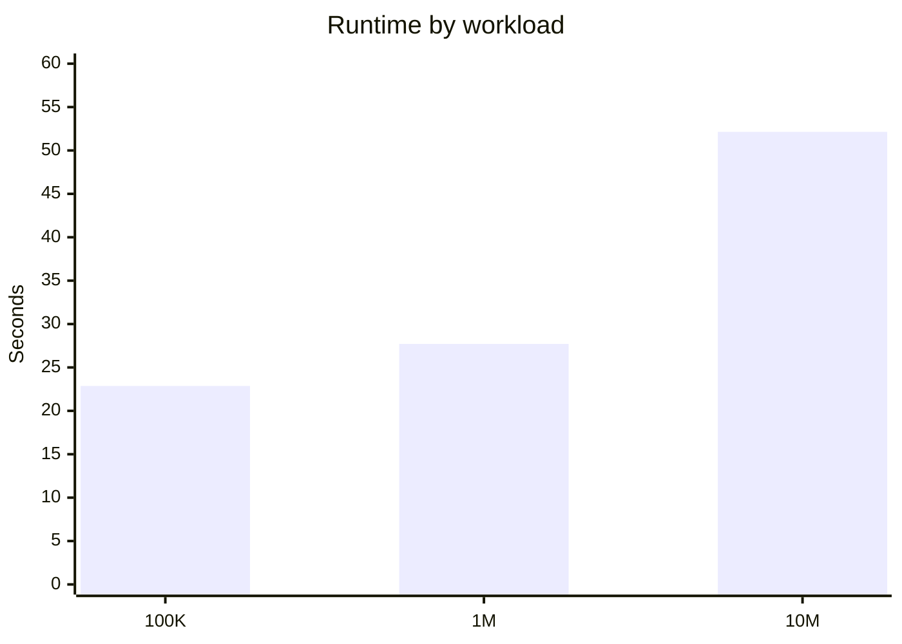
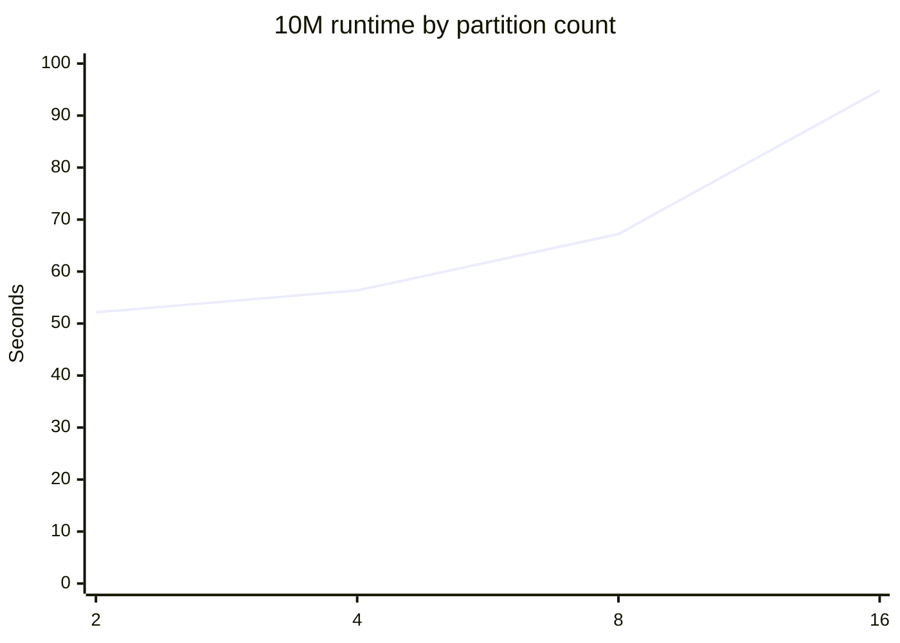

# AWS Spark Benchmark Summary

This document records the measured Spark benchmark progression and the partition-tuning experiment for the synthetic healthcare workload.

## Benchmark environment

| Component | Configuration |
|---|---|
| EC2 | `t3.small` |
| CPU | 2 vCPUs |
| Memory | ~1.9 GiB |
| OS | Amazon Linux 2023 |
| Python | 3.11.15 |
| Java | Corretto 17.0.20 |
| Spark | 3.5.3 |
| Storage | Amazon S3 / Snappy Parquet |
| Remote execution | AWS Systems Manager |

## Measured workload scaling

| Workload | Rows | Partitions | Runtime | Throughput | Status |
|---|---:|---:|---:|---:|---|
| 100K | 100,000 | 2 | 22.866 sec | 4,373.25 rows/sec | Success |
| 1M | 1,000,000 | 2 | 27.710 sec | 36,087.74 rows/sec | Success |
| 10M | 10,000,000 | 2 | 52.146 sec | 191,768.23 rows/sec | Success |

### Scaling observation

The 10M workload completed successfully on the same `t3.small` environment. These are environment-specific measurements and should not be treated as universal Spark performance guarantees.



## 10M partition tuning

The same 10M workload was executed with different initial partition counts.

| Partitions | Runtime | Throughput |
|---:|---:|---:|
| **2** | **52.146 sec** | **191,768.23 rows/sec** |
| 4 | 56.366 sec | 177,410.57 rows/sec |
| 8 | 67.210 sec | 148,786.35 rows/sec |
| 16 | 94.850 sec | 105,429.74 rows/sec |



### Engineering conclusion

On this 2-vCPU `t3.small`, **2 partitions produced the fastest measured run**. Increasing partition count beyond the available CPU parallelism increased scheduling and task-management overhead for this workload.

This result is a tuning observation for this specific environment, not a general recommendation to always use two partitions.

## AWS account constraint

A 50M+ benchmark was not executed because the AWS account rejected attempts to resize the existing EC2 instance from `t3.small` to `t3.medium` and `t3.large` with `FreeTierRestrictionError`.

The project therefore reports **10M as the highest completed measured workload under the current account configuration** rather than publishing an unverified 50M result.

## Reproducibility

The raw benchmark measurements are also stored in:

```text
benchmark/aws_spark_results.json
```

The full Parquet outputs remain in Amazon S3. The GitHub repository contains only a small representative synthetic sample so the repository remains lightweight.
