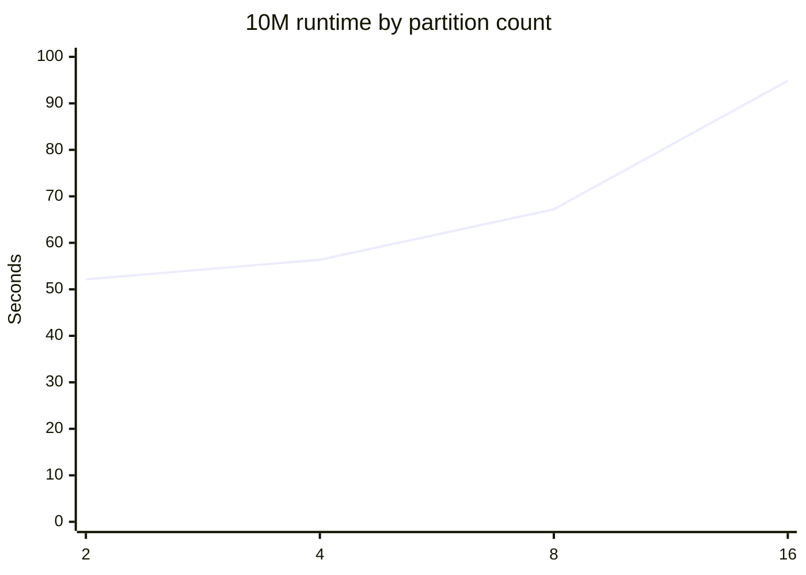

# AWS Spark Benchmark Summary

This document records the measured Spark benchmark progression, the 10M partition-tuning experiment, the verified 50M scale benchmark, and the leakage-free temporal readmission benchmark for the synthetic healthcare workload.

## Benchmark environment

| Component | Configuration |
|---|---|
| EC2 | `t3.small` |
| CPU | 2 vCPUs |
| Memory | ~1.9 GiB |
| OS | Amazon Linux 2023 |
| Python | 3.11.15 |
| Java | Corretto 17.0.20 |
| Spark | 3.5.3 |
| Storage | Amazon S3 / Snappy Parquet |
| Remote execution | AWS Systems Manager |

## Measured workload scaling

| Workload | Rows | Partitions | Runtime | Throughput | S3 objects | S3 size | Status |
|---|---:|---:|---:|---:|---:|---:|---|
| 100K | 100,000 | 2 | 22.866 sec | 4,373.25 rows/sec | 11 | — | Success |
| 1M | 1,000,000 | 2 | 27.710 sec | 36,087.74 rows/sec | 11 | 10.0 MiB | Success |
| 10M | 10,000,000 | 2 | 52.146 sec | 191,768.23 rows/sec | 11 | — | Success |
| **50M** | **50,000,000** | **2** | **156.294 sec** | **319,909.05 rows/sec** | **11** | **440.1 MiB** | **Success** |

## 50M benchmark result

The 50M benchmark completed successfully on the same `t3.small` environment used for the smaller workloads.

| Metric | Measured result |
|---|---:|
| Records processed | **50,000,000** |
| Spark partitions | **2** |
| Runtime | **156.294 seconds** |
| Throughput | **319,909.05 rows/sec** |
| Spark version | **3.5.3** |
| Exit code | **0** |
| S3 output objects | **11** |
| S3 output size | **440.1 MiB** |
| Status | **SUCCESS** |

Output location:

```text
s3a://<benchmark-bucket>/results/50m-t3small
```

The verified S3 layout contains regional patient Parquet partitions for Midwest, Northeast, South, and West plus a summary output.

## Scaling observation

The benchmark scaled from 100K to 50M records on the same EC2 instance. Throughput increased from 4,373.25 rows/sec at 100K to 319,909.05 rows/sec at 50M, while the total 50M runtime was 156.294 seconds.

These measurements are environment-specific reference results and should not be treated as universal Spark performance guarantees.

## 10M partition tuning

The same 10M workload was executed with different initial partition counts.

| Partitions | Runtime | Throughput |
|---:|---:|---:|
| **2** | **52.146 sec** | **191,768.23 rows/sec** |
| 4 | 56.366 sec | 177,410.57 rows/sec |
| 8 | 67.210 sec | 148,786.35 rows/sec |
| 16 | 94.850 sec | 105,429.74 rows/sec |



### Engineering conclusion

On this 2-vCPU `t3.small`, **2 partitions produced the fastest measured 10M run**. Increasing the initial partition count beyond the available CPU parallelism increased task scheduling and management overhead for this workload.

This is a tuning observation for this specific environment, not a general recommendation to always use two partitions.

## Spark temporary-storage optimization

The first cloud benchmark attempt exposed a practical Spark infrastructure issue: the default `/tmp` filesystem was too small for Spark dependency distribution even though the EC2 root volume had additional capacity.

The benchmark was corrected by directing Spark local execution and temporary storage to the persistent benchmark volume:

```bash
mkdir -p /opt/healthcare-benchmark/spark-local
export SPARK_LOCAL_DIRS=/opt/healthcare-benchmark/spark-local
export TMPDIR=/opt/healthcare-benchmark/spark-local
```

The benchmark script uses the same local storage strategy so Spark does not depend on the small `/tmp` filesystem.

The earlier `t3.micro` environment also exposed memory pressure and kernel OOM events. The verified benchmark environment was subsequently run on `t3.small`.

## AWS account constraint

Attempts to resize the existing EC2 instance from `t3.small` to `t3.medium` and `t3.large` were rejected with `FreeTierRestrictionError`. The verified 50M benchmark was therefore completed on the existing `t3.small` configuration.

## Temporal readmission ML benchmark

A separate end-to-end ML validation was executed on the same EC2 environment using a chronological holdout. The Gold dataset was rebuilt after the feature-contract update so the model receives current-encounter features that are available at prediction time while historical aggregates remain derived only from prior encounters.

### Dataset validation

| Check | Result |
|---|---:|
| Gold rows | **198,666** |
| Distinct patients | **198,666** |
| Duplicate patient rows | **0** |
| Gold columns | **18** |
| Temporal cutoff | **2024-07-01** |
| Training rows | **15,165** |
| Test rows | **183,501** |

### Final leakage-free readmission benchmark

| Metric | Result |
|---|---:|
| ROC-AUC | **0.6601** |
| PR-AUC | **0.1753** |
| Precision | **0.1630** |
| Recall | **0.6116** |
| F1 | **0.2574** |

Test-set class support was 164,664 negative observations and 18,837 positive observations. Because the positive class is relatively uncommon, PR-AUC, precision, recall, and F1 are reported alongside ROC-AUC rather than relying on accuracy alone.

### Feature leakage correction

The earlier experiment produced an implausible `ROC-AUC = 1.0` result because the evaluation dataset and feature availability were inconsistent with a realistic temporal prediction workflow. The corrected pipeline uses the following current-encounter fields together with historical aggregates:

```text
age
current_chronic_condition
current_emergency_visit
current_length_of_stay
current_risk_score
encounter_count
emergency_visits
total_los
avg_los
total_cost
prior_readmissions
avg_risk_score
high_utilization
```

`readmitted_30d` remains the prediction target, and `event_date` is used for chronological splitting. The current result of **ROC-AUC 0.6601** and **PR-AUC 0.1753** is the benchmark to use for portfolio reporting.

## Reproducibility

The raw benchmark measurements are stored in:

```text
benchmark/aws_spark_results.json
```

The full Parquet benchmark outputs remain in Amazon S3. The GitHub repository contains only a small representative synthetic sample so the repository remains lightweight.
