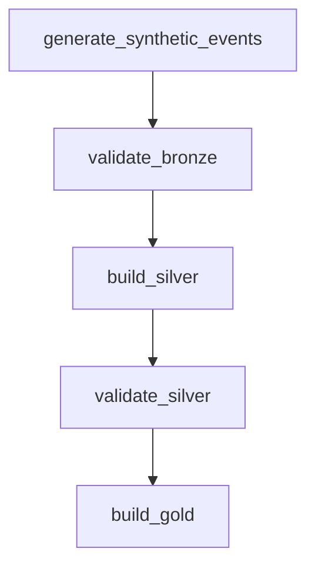

# Executable pipeline and operations evidence

Run from the repository root with Python 3.11/3.12, Java 17 and `requirements.txt` installed:

```bash
python scripts/run_readmission_validation.py --rows 5000 --output-dir artifacts/demo-run-1
```

Open `pipeline-run.json`, `readmission_metrics.json` and `readmission_cohorts.md` in that
directory. The manifest includes stage elapsed times, explicit lineage and Bronze/Silver/Gold
quality counts. Silver is an in-memory transformation in this demo, not a persisted table.
Training uses the discharge-plus-30-day outcome-availability contract.

Recorded local execution: [5K pipeline manifest](operations-demo-result.json), with
5,000 valid events and 3,911 unique Gold patients. Summed timed stages took 25.750 seconds
on this workspace; the run shared host resources with other work and is not a capacity benchmark.
The [separate 10K Spark event summary](local-spark-execution.json) validates log parsing on a
real local application. It does not establish multiple worker hosts or successful worker recovery.

## Pipeline contract

| Area | Implemented behavior | Remaining operational evidence |
|---|---|---|
| Quality | Nonempty events, required-column nulls, encounter duplicates, age/cost/target checks; unique Gold patients | Real-source drift and clinical outcome verification |
| Failure | Record failing stage and exception type; propagate failure | Worker-loss recovery under distributed load |
| Recovery | Use a fresh output directory; inspect `status=passed` before consuming artifacts | Atomic promotion to a production serving location |
| Throughput | Sum of timed stage durations and rows per stage-second in manifest | Wall-clock SLA across scheduler queues and startup/shutdown |
| Lineage | Generator → Bronze → Silver → Gold → model/cohorts | External catalog integration and historical source snapshots |
| Orchestration | Existing daily Airflow DAG declares two retries | No measured Airflow availability or SLA guarantee |

The timed-stage rate excludes Spark shutdown and orchestration overhead. It is not directly
comparable with the historical 50M-row generation/aggregation benchmark. Failed runs may
leave partial files; a manifest with `failed` or `running` is never publishable evidence.
There is no automatic retry loop in this CLI. Its injected storage-failure test validates
failure reporting, not a real cloud outage or successful worker recovery.

## Airflow graph

This diagram mirrors task IDs and dependencies in `dags/healthcare_pipeline.py`; it is
not a screenshot of a running scheduler. The standalone model-validation CLI above is separate.



## Two-minute demonstration

- 0:00–0:25: Explain why a 30-day readmission label may be unavailable at prediction or fit time.
- 0:25–0:55: Run the command and show the lineage and quality counts in `pipeline-run.json`.
- 0:55–1:25: Show immature-label exclusions and cohort evaluation in the output reports.
- 1:25–2:00: Show the failure-path test and distinguish local execution from the historical
  single-node AWS benchmark and the pending multi-node experiment.
